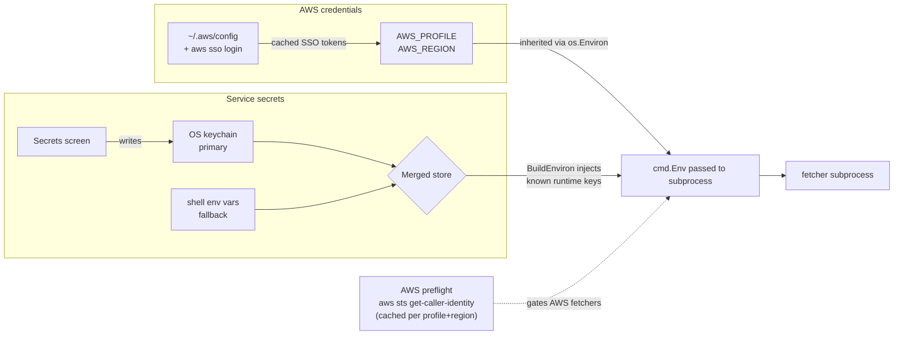

# Auth and secrets

Two kinds of credentials end up in the fetcher subprocess:

- **AWS credentials** — owned by the system `aws` CLI. The TUI never
  reads or writes them; it just selects a profile and region.
- **Service secrets** — `KNOWBE4_API_KEY`,
  `PARAMIFY_UPLOAD_API_TOKEN`, `PARAMIFY_API_BASE_URL`. Stored in OS
  keychain, environment, or a merge of both.

Key facts:

- `--secrets-backend=merged|keychain|env` at startup picks the store.
  Default is `merged` (keychain primary, env fallback, keychain
  writer).
- The Secrets screen lists every catalog source plus a pinned Paramify
  entry. Editable keys come from the table in
  [`internal/secrets/requirements.go`](../internal/secrets/requirements.go);
  `ValidateKey` and `RuntimeKeys` derive their allowlists from the
  same table so you can't accidentally write unrelated env vars into
  the keychain.
- Secrets are injected into the subprocess via `cmd.Env`, never written
  into temp files or arguments. Values never appear in the session log.
- AWS preflight is run once per `(profile, region)` per `Start()` call
  and cached. If it fails, AWS-flavored fetchers fail-fast with a clear
  message before exec.
- KnowBe4-flavored fetchers are similarly fail-fasted on a non-empty
  `KNOWBE4_API_KEY` in the resolved env (runner-side, not a TUI gate).
- All other "missing X token" failures surface as ordinary non-zero
  exits from the fetcher script itself; the operator opens Secrets,
  sets the key, and retries.
