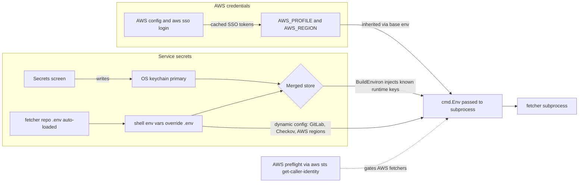

# Auth and secrets

Two kinds of credentials end up in the fetcher subprocess:

- **AWS credentials** — owned by the system `aws` CLI. The TUI never
  reads or writes them; it just selects a profile and region.
- **Service secrets** — `KNOWBE4_API_KEY`,
  `PARAMIFY_UPLOAD_API_TOKEN`, `OKTA_API_TOKEN`, and similar API keys.
  Stored in OS keychain, environment, auto-loaded `.env`, or a merge of
  those sources.

Key facts:

- `--secrets-backend=merged|keychain|env` at startup picks the store.
  Default is `merged` (keychain primary, env fallback, keychain
  writer).
- `--env-file` can point at a dotenv file. In live mode, the default is
  `<fetcher-repo-root>/.env` when present. Shell environment values win
  over `.env`, and keychain values win over both for TUI-managed secret
  keys.
- The Secrets screen lists every catalog source plus a pinned Paramify
  entry. Editable keys come from the table in
  [`internal/secrets/requirements.go`](../internal/secrets/requirements.go);
  `ValidateKey` and `RuntimeKeys` derive their allowlists from the
  same table so you can't accidentally write unrelated env vars into
  the keychain.
- Secrets are injected into the subprocess via `cmd.Env`, never written
  into temp files or arguments by the Go runner. Values never appear in
  the session log.
- Dynamic runtime config that is not keychain-managed, such as
  `GITLAB_PROJECT_<N>_*`, `AWS_REGION_<N>_*`, and `CHECKOV_*`, can come
  from the auto-loaded `.env` without requiring the user to source it
  before launch.
- AWS preflight is run once per `(profile, region)` per `Start()` call
  and cached. If it fails, AWS-flavored fetchers fail-fast with a clear
  message before exec.
- Non-AWS fetchers (KnowBe4, Okta, etc.) do not get runner-side secret
  preflight. Missing tokens surface as ordinary non-zero exits from the
  fetcher script; the operator opens Secrets, sets the key, and retries.
