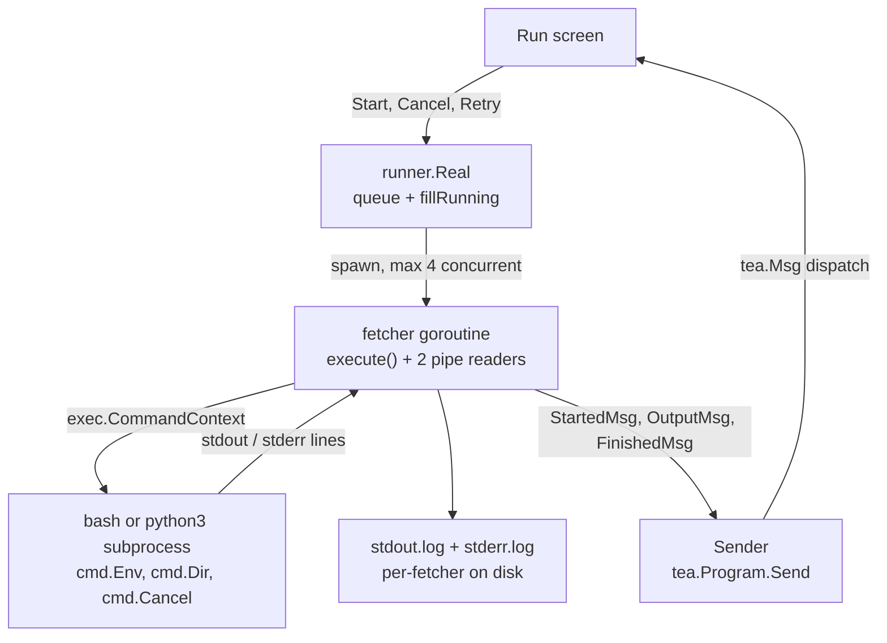
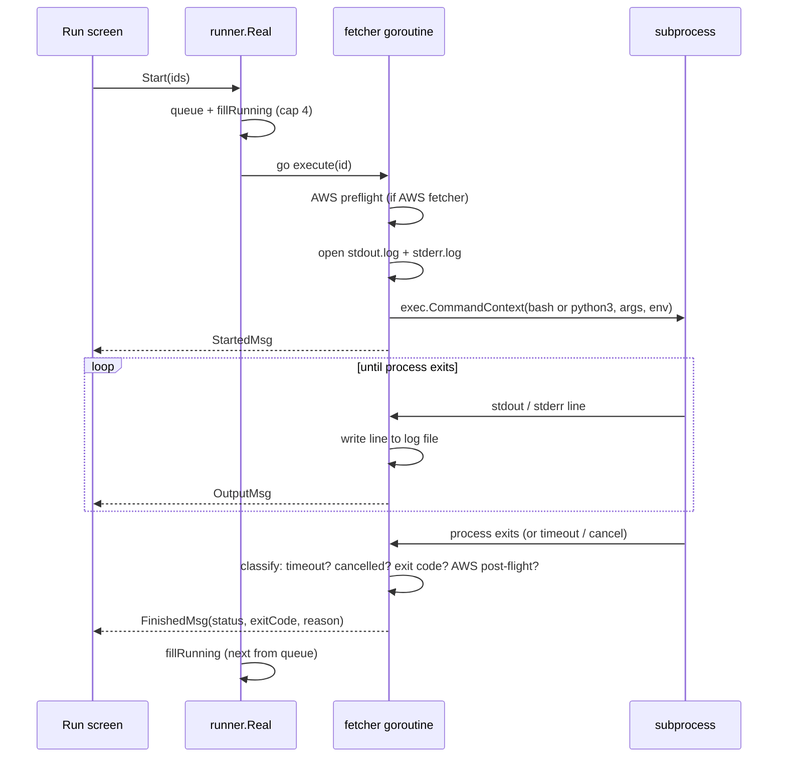

# Subprocess management

How the Run screen turns "the user picked these fetchers" into running
processes and back into UI updates.

## Architecture

Who is involved and which way data flows:

## Lifecycle of one fetcher

What happens between `Start` and the final message:

Key facts:

- **Concurrency cap is 4.** Selecting 30 fetchers means 4 run at a
  time; the rest sit in the queue.
- **Each fetcher gets its own goroutine, plus two more for the stdout
  and stderr pipe readers.** They write the line to a per-fetcher log
  file and emit one `OutputMsg` per line.
- **Cancellation is `SIGTERM`, then `SIGKILL` after 5s.** The Run
  screen never calls cancel directly — it sends a `tea.Cmd` that the
  runner translates.
- **Status classification is ordered**: deadline → context-cancelled →
  exit code → AWS post-flight validation. The first match wins.
- **The runner only talks back to the UI through `Sender.Send`.** The
  goroutine never touches the Bubble Tea model directly; that's the
  whole reason the bridge exists.
- **`summary.json` is written when the last fetcher finishes**, not
  per-fetcher.
