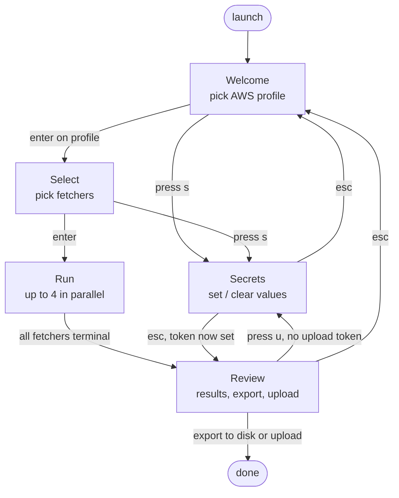

# User flow

What an operator does, from launching the tool to being done.

Notes:

- Secrets is reachable from Welcome, Select, and Review. The escape
  destination depends on which screen routed in — the router remembers
  it.
- The Secrets screen lists every catalog source plus a pinned Paramify
  entry. Sources without env-var creds (aws, k8s, ssllabs, …) render an
  info row instead of editable keys.
- **Run is not gated on selection-specific secrets.** The TUI offers a
  place to store keys; deciding which keys a fetcher needs is the
  fetcher's job. Missing keys surface as fetcher failures — the
  operator fixes via Secrets and retries the failed card.
- The upload-token detour from Review *is* a gate: if
  `PARAMIFY_UPLOAD_API_TOKEN` is missing at the moment the user
  presses upload, Review routes through Secrets so the upload can
  proceed.
- `Ctrl+C` / `Q` quit from any screen; not drawn.
