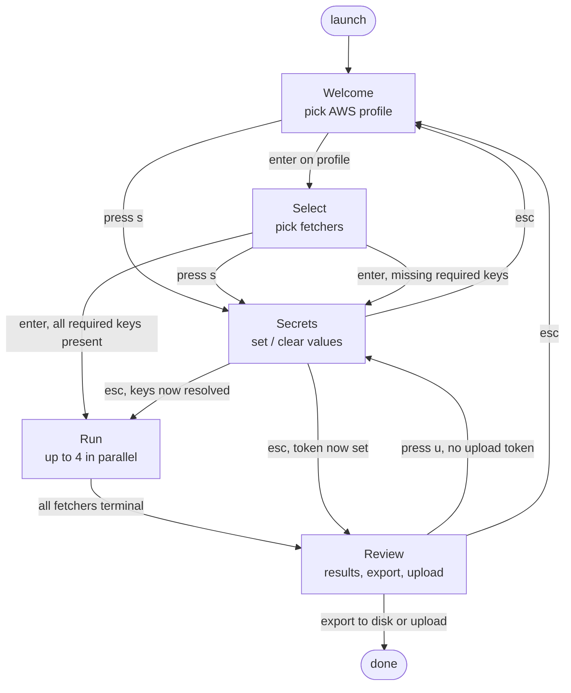

# User flow

What an operator does, from launching the tool to being done.

Notes:

- Secrets is reachable from Welcome, Select, and Review. The escape
  destination depends on which screen routed in — the router remembers
  it.
- "Required keys" are derived from the current selection: e.g. if a
  KnowBe4 fetcher is selected, `KNOWBE4_API_KEY` is required before
  Run starts.
- The upload-token detour from Review only fires if
  `PARAMIFY_UPLOAD_API_TOKEN` is missing at the moment the user presses
  upload (so a token cleared mid-session is caught).
- `Ctrl+C` / `Q` quit from any screen; not drawn.
